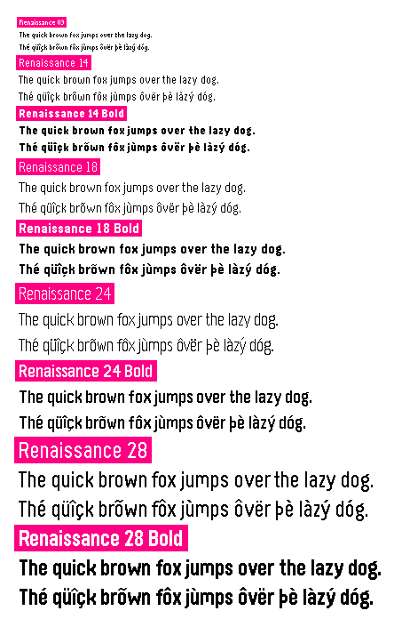

# Renaissance

A (mostly) metrically compatible replacement for Raster Gothic Condensed in Pebble font format.

Please see the [wiki](https://github.com/pebble-dev/renaissance/wiki) for more information.

While this project is still in its earliest stages, here are some thoughts on the font design process:

- Encoding the font source in plain text files is preferable because it allows viewing and editing with small overhead.
- A tool should be written to convert aforementioned text files to font files (described [here](https://github.com/pebble-dev/wiki/wiki/Firmware-Font-Format))
- Use `metrics.py` to extract metrics information from font files.
  I've extracted metrics for all Gothic fonts and placed this data into `metrics.json`.
- Use `merge_pbff.py` to merge two pbff files, taking actual character shapes from the first and character metadata (eg positioning) from the second.
    - Use this when you're starting work on a new font size: simply merge in the glyph data from the smaller size.

## Metrical Compatibility

Renaissance needs to be _mostly_ metrically compatible. This means that the
entire basic ASCII set & symbols should have the same `advance` number and the
same baseline/x-height/etc. However, some Latin-extended characters, such as
those with certain diacritics, may be slightly different.

In order to improve legibility, Renaissance 9 explicitly does _not_
follow the goal of metrical compatibility.

## Design

I'm by no means a type designer. If you'd like to raise any concern about the
font (especially concerning diacritics), _please_ let me know!

Here are some guidelines for Renaissance's design:

- No stroke modulation (all strokes in a glyph should be the same width)
    - Except diacritics in small font sizes & certain characters like @
- Grotesque style
- Comparatively short ascenders/descenders (1/3 to 1/2 x-height.)
- Legibility is just as important as consistency.
- When a diacritic can't be centered over a character, move it right.
    - Except characters like g where it might interfere
      (e.g. double-story lowercase g)
- All characters should be available in all fonts (some fonts are
  missing the `×` character)
    - Exception: Renaissance 9 needn't contain all diacritics because they may
      be hard to tell apart at that size.
- Carons must _always_ be distinguishable from breves.

## Copyright concerns

To my best understanding, only outline fonts are protected by US intellectual
property law. Nevertheless, Renaissance is a from-scratch remake of
Gothic Condensed—not a simple copy of it. Either way, most characters will look
similar, and others will even be the exact same: there simply aren't infinite
ways to represent a given character within a given bitmap.
